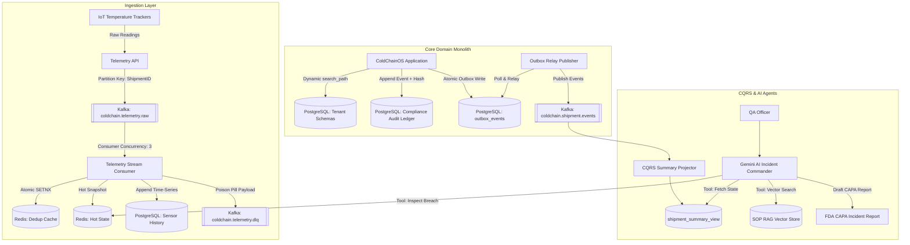

# ColdChainOS

Multi-tenant logistics platform for tracking, telemetry ingestion, and regulatory compliance of temperature-controlled pharmaceutical supply chains.

Built as a high-throughput modular monolith enforcing strict domain boundaries, schema-level multi-tenancy, transactional outbox publishing, cryptographic audit trails, and automated regulatory incident investigation.

---

## Architectural Highlights

- **Schema-per-Tenant Isolation**: Physical schema separation in PostgreSQL per tenant, dynamic connection routing via Hibernate's `MultiTenantConnectionProvider`, and zero cross-tenant leakage.
- **Transactional Outbox & Kafka Relay**: Guarantees at-least-once event delivery by storing domain events in a PostgreSQL outbox table within the business transaction, relayed asynchronously to Apache Kafka 3.7 (KRaft mode).
- **High-Throughput IoT Telemetry Pipeline**:
  - Partition affinity by shipment ID to guarantee strict sequential ordering.
  - Redis 7 atomic `SETNX` packet deduplication (10-minute sliding window).
  - Dead Letter Queue (`coldchain.telemetry.dlq`) with fast-path poison pill isolation to prevent head-of-line blocking.
- **CQRS Read Projections**: Asynchronous Kafka event projector updating a de-normalized, single-table summary view (`shipment_summary_view`) for zero-locking reads.
- **Distributed Sagas & Compensation**: Durable state-machine orchestrator coordinating multi-step dispatch workflows (warehouse slot booking, 3PL carrier reservation, customs clearinghouse validation) with automatic backward compensation on failure.
- **FDA 21 CFR Part 11 Cryptographic Audit Ledger**:
  - Linear SHA-256 Merkle hash chain linking every state change to its predecessor.
  - Continuous verification engine that detects historical data tampering or out-of-band SQL mutations down to the exact corrupted sequence number.
- **Distributed Token Bucket Rate Limiting**: Atomic Redis Lua script enforcing per-tenant burst capacity and refill rates with sub-millisecond overhead.
- **AI Incident Commander (RAG + LangChain4j + Google Gemini)**:
  - Vector knowledge base indexing manufacturer stability specs (Pfizer/Moderna mRNA, Insulin, Plasma, Cryogenic CAR-T).
  - Autonomous investigation agent with tool calling (`getShipmentDetails`, `getTelemetryData`, `searchSopStabilityGuidelines`, `getCryptographicAuditTrail`).
  - Strict regulatory guardrails: the agent formulates FDA-compliant CAPA reports but cannot execute irreversible state transitions without human QA electronic sign-off.

---

## Architecture Diagram



---

## Tech Stack

| Component | Technology | Version |
| :--- | :--- | :--- |
| **Language & Framework** | Java / Spring Boot | Java 17, Spring Boot 3.2.5 |
| **Relational Database** | PostgreSQL | 16 (Alpine) |
| **Database Migrations** | Flyway | Core 10.x |
| **Distributed Cache & Dedup** | Redis | 7 (Alpine) via Lettuce pool |
| **Event Streaming** | Apache Kafka | 3.7 (KRaft mode, zero Zookeeper) |
| **AI / LLM Framework** | LangChain4j | 0.34.0 (Google AI Gemini + AllMiniLM-L6-v2) |
| **Resilience & Circuit Breakers** | Resilience4j | 2.2.0 (Spring Boot 3 + AOP) |
| **Security & Auth** | Spring Security / JJWT | Spring Security 6, JJWT 0.12.5 |
| **Observability** | Micrometer & OpenTelemetry | Actuator, Prometheus, OTel Tracing Bridge |
| **Container Runtime** | Docker / AWS ECS Fargate | Multi-stage Dockerfile, AWS Task Definition |

---

## Repository Structure

```
ColdChainOS/
├── docs/                               # System requirements, ADRs, context diagrams, runbook
│   ├── 01-problem-statement.md
│   ├── 02-functional-requirements.md
│   ├── 03-non-functional-requirements.md
│   ├── 07-context-diagram.md
│   ├── 08-production-readiness-runbook.md
│   └── 09-aws-deployment-architecture.md
├── src/main/java/com/coldchainos/
│   ├── ai/                             # Gemini AI Incident Commander, RAG & SOP store
│   ├── audit/                          # 21 CFR Part 11 SHA-256 cryptographic ledger
│   ├── benchmark/                      # Operational load & latency benchmarking harness
│   ├── saga/                           # Distributed saga state machine & orchestrator
│   ├── shared/                         # Multi-tenancy context, outbox, rate limiting, security
│   ├── shipment/                       # Shipment aggregate root, telemetry, Kafka streaming, CQRS
│   ├── tenant/                         # Tenant catalog & dynamic schema provisioning
│   └── warehouse/                      # Warehouse slot aggregate, pessimistic locking lab
├── src/main/resources/
│   ├── db/migration/                   # Flyway forward migrations V1 through V8
│   ├── application.yml                 # Base development profile
│   └── application-prod.yml            # Production-tuned connection pools & batch configs
├── .github/workflows/deploy-aws.yml    # Automated CI/CD pipeline deploying to AWS ECR & ECS
├── Jenkinsfile                         # Declarative Jenkins pipeline for container deployment
├── docker-compose.yml                  # Local development stack (Postgres, Redis, Kafka KRaft)
├── docker-compose.prod.yml             # Production composition with Prometheus
├── Dockerfile                          # Hardened multi-stage container build
└── build.gradle.kts                    # Gradle build configuration
```

---

## Quickstart

### 1. Prerequisites
- Docker & Docker Compose
- Java 17+ (JDK)

### 2. Start Infrastructure Containers
```bash
docker-compose up -d
```
This starts:
- **PostgreSQL 16**: Port `5438` (database `coldchainos_db`)
- **Redis 7**: Port `6389`
- **Apache Kafka 3.7 KRaft**: Port `9094`

### 3. Environment Configuration
Copy the template to configure local variables:
```bash
cp .env.example .env
```
Key variables:
```properties
SPRING_DATASOURCE_URL=jdbc:postgresql://localhost:5438/coldchainos_db?prepareThreshold=5&reWriteBatchedInserts=true
SPRING_DATASOURCE_USERNAME=coldchain_admin
SPRING_DATASOURCE_PASSWORD=coldchain_secret_password
REDIS_HOST=localhost
REDIS_PORT=6389
KAFKA_BOOTSTRAP_SERVERS=localhost:9094
GEMINI_API_KEY=your_gemini_api_key_here
```
*(Note: If `GEMINI_API_KEY` is left as `demo` or blank, the system automatically uses a deterministic offline regulatory fallback engine).*

### 4. Build and Run
```bash
# Build production fat jar
./gradlew bootJar -x test

# Run application
./gradlew bootRun
```
The server binds to `http://localhost:8080`.

---

## Core API Endpoints

### 1. AI Incident Commander & SOP RAG
```bash
# Autonomous incident investigation (generates FDA CAPA report)
POST /api/v1/ai/incidents/investigate/{shipmentId}
Headers: X-Tenant-ID: pharma_corp

# Vector semantic search over regulatory stability guidelines
POST /api/v1/ai/sop/search?query=mRNA%20vaccine%20dry%20ice

# List indexed SOP stability specifications
GET /api/v1/ai/sop/catalog
```

### 2. CQRS Read Queries (Non-locking single table)
```bash
# List all shipments for tenant
GET /api/v1/shipments/summary
Headers: X-Tenant-ID: pharma_corp

# Query quarantined shipments
GET /api/v1/shipments/summary/quarantined
Headers: X-Tenant-ID: pharma_corp

# Lookup by tracking number
GET /api/v1/shipments/summary/tracking/{trackingNumber}
```

### 3. Performance & Load Benchmarks
```bash
# Run full benchmark suite (Rate limiting, Audit traversal, Telemetry streaming)
POST /api/v1/benchmarks/full-suite?tenantId=pharma_corp

# Benchmark 21 CFR Part 11 audit verification throughput
POST /api/v1/benchmarks/audit-ledger?tenantId=pharma_corp&blocks=500

# Benchmark Redis token bucket rate limiter saturation
POST /api/v1/benchmarks/rate-limiter?tenantId=pharma_corp&requests=2000&capacity=100&refillRate=50
```

### 4. Operational Health & Metrics
```bash
# Health status (Database, Redis, Kafka, Disk)
GET /actuator/health

# Container health probes
GET /actuator/health/liveness
GET /actuator/health/readiness

# Prometheus metrics scraping
GET /actuator/prometheus
```

---

## Regulatory Compliance & Invariants

- **FDA 21 CFR Part 11 / EU Annex 11**: All critical state changes (excursions, custody transfers, releases) are recorded in an append-only cryptographic ledger. Linear hash chaining ensures that any modified historical record is detected during automated verification audits.
- **Strict Human-in-the-Loop Guardrail (FR-042)**: The AI Incident Commander cannot execute state changes directly (such as releasing quarantine or condemning stock). It formulates structured evidence and root-cause analysis for review by an authorized QA manager.
- **Idempotent Delivery Guarantee**: Downstream Kafka listeners implement an insert-first reservation pattern against the `consumed_events` table with unique constraints on `(consumer_name, event_id)` to ensure exact-once execution semantics under at-least-once message delivery.

---

## AWS Cloud Deployment (Amazon ECS on AWS Fargate)

Rather than introducing the operational overhead and cluster maintenance of Kubernetes, ColdChainOS is optimized for **Amazon ECS on AWS Fargate**—running containerized tasks serverless behind an Application Load Balancer.

### 1. Build and Run Container Locally
```bash
docker build -t coldchainos/backend:latest .
docker run -p 8080:8080 --env-file .env coldchainos/backend:latest
```

### 2. Production AWS Topology
- **Compute**: Amazon ECS (AWS Fargate) with zero server management and automatic horizontal task autoscaling.
- **Database**: Amazon RDS for PostgreSQL 16 (Multi-AZ synchronous primary/standby).
- **Cache**: Amazon ElastiCache for Redis 7 (Multi-AZ replication group).
- **Event Streaming**: Amazon MSK (Managed Streaming for Apache Kafka).
- **Ingress**: AWS Application Load Balancer (ALB) terminating HTTPS via AWS Certificate Manager (ACM).

### 3. Automated CI/CD
Every commit pushed to `main` triggers `.github/workflows/deploy-aws.yml`, which:
1. Compiles and packages the production archive.
2. Builds and tags the Docker image with the git commit SHA.
3. Pushes the container to **Amazon ECR**.
4. Triggers a zero-downtime rolling service deployment on **Amazon ECS**.

Detailed operational runbooks and disaster recovery procedures are documented in [`docs/08-production-readiness-runbook.md`](docs/08-production-readiness-runbook.md) and [`docs/09-aws-deployment-architecture.md`](docs/09-aws-deployment-architecture.md).
