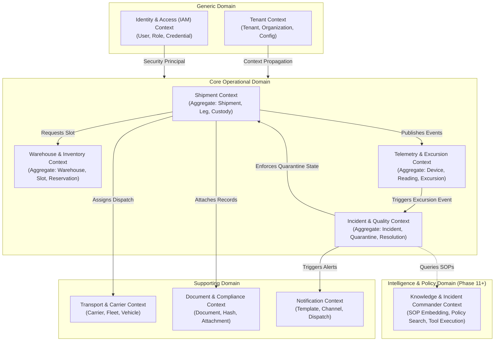
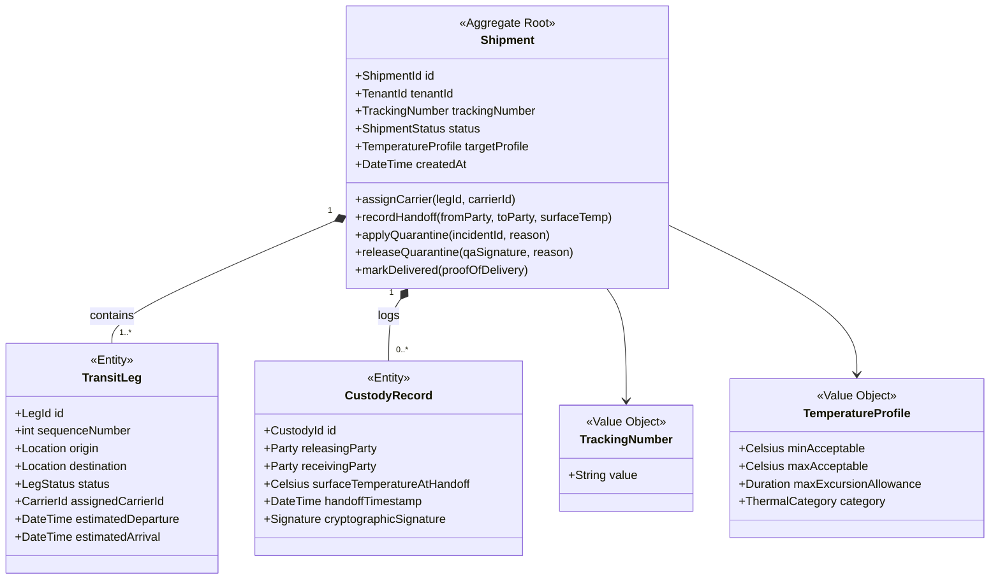
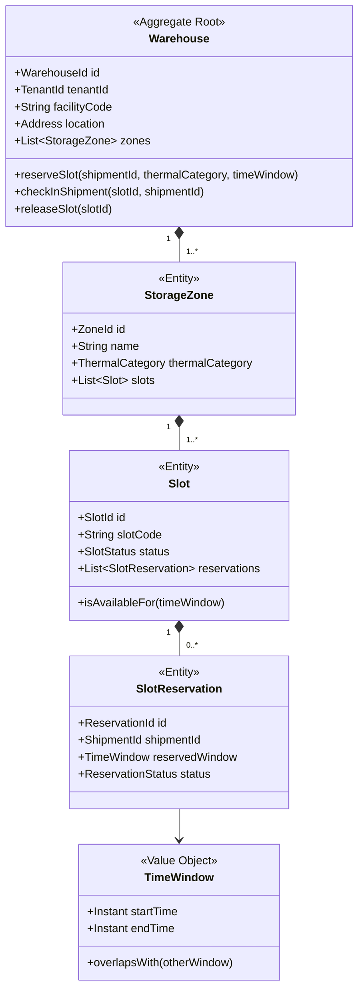

# ColdChainOS — Domain-Driven Design (DDD) Model

## 1. Strategic Design: Bounded Contexts

A foundational principle of ColdChainOS is **Domain-Driven Design (DDD)**. We do not design around database tables or generic CRUD operations; we model real-world operational boundaries, language, and business invariants.

---

## 2. Bounded Context Responsibilities & Ubiquitous Language

| Bounded Context | Classification | Core Responsibility | Ubiquitous Language Terms |
| :--- | :--- | :--- | :--- |
| **Shipment Context** | **Core Domain** | Governs the lifecycle state machine of cargo from origin booking to final delivery; maintains the verified chain of custody. | `Shipment`, `TrackingNumber`, `TransitLeg`, `ChainOfCustody`, `Handoff`, `StabilityProfile`, `Quarantined`. |
| **Warehouse Context** | **Core Domain** | Manages physical temperature-controlled facilities, zones, storage bays, and atomic reservation of slots to prevent staging overbooking. | `Warehouse`, `StorageZone`, `Slot`, `SlotReservation`, `ThermalTier` (-80C, -20C, 2-8C, 15-25C), `Intake`, `Putaway`. |
| **Telemetry Context** | **Core Domain** | Ingests high-frequency ambient sensor data, links readings to active shipments, and continuously evaluates excursion thresholds and MKT. | `TelemetryReading`, `SensorLogger`, `Excursion`, `MeanKineticTemperature (MKT)`, `SamplingWindow`. |
| **Incident Context** | **Core Domain** | Coordinates deviations, temperature excursions, and physical damages. Manages legal quarantine locks and QA resolution workflows. | `Incident`, `SeverityLevel`, `QuarantineLock`, `Investigation`, `CorrectiveAction (CAPA)`, `DigitalSignature`. |
| **Transport Context** | **Supporting** | Maintains approved carrier directory, reefer truck profiles, driver assignments, and vehicle refrigeration certifications. | `Carrier`, `TransportVehicle`, `ReeferUnit`, `Driver`, `CarrierSLA`. |
| **Document Context** | **Supporting** | Manages digital compliance artifacts, bills of lading, certificates of analysis, and cryptographic SHA-256 validation. | `DocumentManifest`, `CertificateOfAnalysis (CoA)`, `BillOfLading (BoL)`, `ChecksumHash`, `TamperProofSeal`. |
| **Notification Context**| **Supporting** | Orchestrates omnichannel alerts (Email, SMS, Webhooks) and multi-level escalation trees upon critical operational triggers. | `Notification`, `EscalationPolicy`, `AlertSubscription`, `WebhookPayload`. |
| **Tenant & Identity** | **Generic** | Manages organizations, users, roles (RBAC), digital credentials, and tenant isolation policies. | `Tenant`, `TenantSchema`, `Principal`, `Role`, `Permission`, `21CFR11Signature`. |

---

## 3. Tactical Design: Aggregates, Entities, Value Objects & Invariants

### 3.1 The `Shipment` Aggregate

The `Shipment` Aggregate Root is the operational backbone of ColdChainOS. It encapsulates transit legs and custody handoffs.

#### Invariants Enforced by `Shipment` Aggregate:
1. **Linear Leg Progression**: A leg $N$ cannot start until leg $N-1$ is in status `COMPLETED`.
2. **Deterministic State Transitions**: 
   * `CREATED` $\rightarrow$ `ASSIGNED` $\rightarrow$ `IN_TRANSIT` $\rightarrow$ `AT_PORT` $\rightarrow$ `WAREHOUSE` $\rightarrow$ `DELIVERED`
   * Transition to `DELIVERED` requires all prior legs completed and zero active quarantine locks.
3. **Quarantine Lock**: When `applyQuarantine()` is invoked:
   * State immediately shifts to `QUARANTINED`.
   * Further leg transitions and final delivery dispatches are strictly blocked until a valid `releaseQuarantine()` is executed with an authorized QA digital signature.
4. **Handoff Temperature Check**: Custody transfer cannot be recorded without measuring and persisting the physical surface temperature of the outer payload container.

---

### 3.2 The `Warehouse` & `Slot` Aggregate

This aggregate enforces the physical and temporal capacity invariants of cold storage facilities.

#### Invariants Enforced by `Warehouse` Aggregate:
1. **Thermal Compatibility**: A slot in a `COLD` zone (+2°C to +8°C) cannot be reserved for an `ULTRA_COLD` (-80°C) product.
2. **Zero Overlapping Reservations (Concurrency Invariant)**: For a given `Slot`, no two reservations can overlap in `TimeWindow` unless one of the reservations is explicitly in status `CANCELLED` or `RELEASED`.
3. **Capacity Ceiling**: Total concurrent occupied + reserved slots in a zone cannot exceed the physical slot count of that zone.

---

### 3.3 The `TelemetryReading` & `Excursion` Aggregate

Ingests time-series metrics and computes environmental breach rules.

#### Key Entities & Value Objects:
* **`TelemetryReading`**:
  * Value Object: `(DeviceId, Timestamp, Temperature, Humidity, Battery, LatLon)`.
  * Invariant: `Timestamp` must not be in the future relative to server UTC clock ($+\text{tolerance } 5 \text{ min}$ for minor clock drift).
  * Invariant: Duplicate readings with identical `(device_id, timestamp)` are idempotent no-ops.
* **`ExcursionBreach`**:
  * Created when temperature $> T_{max}$ or $< T_{min}$ continuously exceeds the shipment's stability grace window.
  * Emits Domain Event: `TemperatureExcursionDetected`.

---

### 3.4 The `Incident` Aggregate

Manages operational anomalies, investigation notes, and 21 CFR Part 11 electronic sign-offs.

#### Key Invariants:
1. **Severity Auto-Assignment**: Any excursion on a pharma Tier-1 (biologic) payload automatically creates a `SEV-1 Critical` incident.
2. **Tamper-Evident Resolution**: An incident cannot transition from `OPEN` / `UNDER_INVESTIGATION` to `RESOLVED` without:
   * Formal resolution code (`DISPOSITION_RELEASE`, `DISPOSITION_DESTROY`, `DISPOSITION_RETURN`).
   * Explicit digital signature (User ID, hashed password verification token, cryptographic timestamp, and free-text justification).

---

## 4. Key Domain Events

Domain events represent facts that have occurred in the business domain. They are immutable and past-tense.

| Domain Event | Emitted By | Payload Highlights | Downstream Reactions |
| :--- | :--- | :--- | :--- |
| `ShipmentCreated` | `Shipment` | `shipmentId`, `trackingNumber`, `profile`, `tenantId` | Allocates documentation checklist; registers initial audit milestone. |
| `CarrierAssigned` | `Shipment` | `shipmentId`, `legId`, `carrierId`, `pickupTime` | Notifies carrier dispatch; triggers carrier SLA timer. |
| `SlotReserved` | `Warehouse` | `warehouseId`, `slotId`, `shipmentId`, `timeWindow` | Updates warehouse capacity forecast; confirms cross-dock leg. |
| `CustodyTransferred` | `Shipment` | `shipmentId`, `releasingParty`, `receivingParty`, `temp` | Records legally binding chain-of-custody handoff; notifies shipper. |
| `TelemetryRecorded` | `Telemetry` | `readingId`, `shipmentId`, `temp`, `humidity`, `timestamp` | Appends time-series log; recalculates MKT stability curve. |
| `TemperatureExcursionDetected` | `Telemetry` | `shipmentId`, `currentTemp`, `threshold`, `breachDuration` | **Triggers Incident creation; automatically locks shipment into QUARANTINED.** |
| `ShipmentQuarantined` | `Incident` | `shipmentId`, `incidentId`, `reason`, `timestamp` | Halts carrier dispatch; blocks warehouse exit gates; pages QA lead. |
| `ShipmentDelivered` | `Shipment` | `shipmentId`, `deliveryTimestamp`, `receiverSignature` | Completes lifecycle; triggers final compliance archive report. |

---

## 5. Architectural Interview Defense: Aggregate Boundaries

> **Interviewer**: *"Why did you separate `Shipment` and `WarehouseSlot` into different Aggregates instead of making `SlotReservation` an inner entity inside `Shipment`?"*
>
> **Your Answer**:
> *"An Aggregate is a consistency boundary governed by business invariants, not a relational convenience. 
> 
> If `SlotReservation` were inside `Shipment`, two different shipments trying to reserve the same physical warehouse slot would modify two different `Shipment` aggregate roots. The system would have no single transactional boundary to enforce the invariant that **'one slot cannot be double-booked'**.
> 
> By making `Warehouse` (or `Slot`) its own aggregate root, all reservation attempts for that physical facility pass through the slot's concurrency lock. The `Shipment` merely holds a reference to the `slotId` as an external identifier."*
