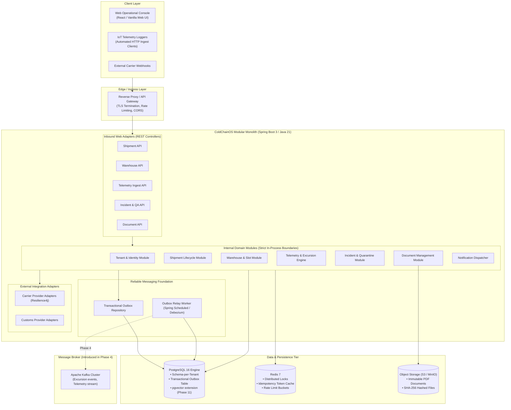

# ColdChainOS — System Context & Container Architecture (C4 Model)

## 1. System Context Diagram (C4 Level 1)

The System Context diagram illustrates how ColdChainOS fits into the broader enterprise logistics and regulatory ecosystem.

```mermaid
flowchart TB
    subgraph Users["Human Actors"]
        PharmaOps["Pharma / Food Shipper<br/>(Dispatcher, Ops Lead)"]
        CarrierDriver["3PL Carrier / Fleet<br/>(Driver, Fleet Dispatch)"]
        WarehouseStaff["Cold Storage Staff<br/>(Forklift Operator, Intake Lead)"]
        QAOfficer["Quality Assurance Officer<br/>(Compliance, Auditor)"]
        CustomsAgent["Customs Broker<br/>(Clearance Agent)"]
    end

    subgraph CoreSystem["ColdChainOS Platform"]
        ColdChainApp["<b>ColdChainOS</b><br/>Multi-Tenant Cold Chain Orchestration Platform<br/><i>Tracks custody, temperature, warehouse slots, and compliance</i>"]
    end

    subgraph ExternalSystems["External Systems & Peripherals"]
        IoTGateway["IoT Sensor Gateways<br/>(Cellular, BLE, Satellite Loggers)"]
        CarrierAPIs["3PL Carrier APIs<br/>(Carrier A, Carrier B Dispatch)"]
        CustomsPortals["Customs EDI Systems<br/>(Port of Entry Clearance)"]
        EmailSMS["Notification Gateways<br/>(Twilio, SendGrid, SES)"]
        ObjectStore["Object Storage<br/>(AWS S3 / MinIO Documents)"]
    end

    PharmaOps -->|Creates shipments, reviews alerts| ColdChainApp
    CarrierDriver -->|Acknowledges dispatch, confirms custody| ColdChainApp
    WarehouseStaff -->|Checks in cargo, reserves slots| ColdChainApp
    QAOfficer -->|Investigates excursions, digital sign-off| ColdChainApp
    CustomsAgent -->|Uploads clearance manifests| ColdChainApp

    IoTGateway -->|Streams ambient telemetry (HTTP/MQTT)| ColdChainApp
    ColdChainApp -->|Dispatches legs, polls status| CarrierAPIs
    ColdChainApp -->|Polls clearance status| CustomsPortals
    ColdChainApp -->|Sends urgent excursion alerts| EmailSMS
    ColdChainApp -->|Stores tamper-evident PDFs/manifests| ObjectStore
```

---

## 2. Container Diagram (C4 Level 2) — Modular Monolith Architecture (V1)

In alignment with our core architectural principle, **ColdChainOS begins as a structured, modular monolith**, NOT a premature mesh of 10 microservices. All domain modules run within a single cohesive runtime process, sharing a high-performance relational database with strict schema isolation.



---

## 3. Communication Patterns (Synchronous vs. Asynchronous)

| Flow | Pattern | Protocol | Why This Choice? |
| :--- | :--- | :--- | :--- |
| **Shipment Booking & State Transition** | Synchronous Request-Response | HTTP/JSON | The caller immediately requires the generated tracking number and state validation confirmation. |
| **Warehouse Slot Reservation** | Synchronous ACID Transaction | Database Transaction | Enforces strict concurrency control. A slot is either reserved or an immediate conflict error is returned to the user. |
| **Telemetry Ingestion** | Synchronous ACK, Async Evaluation | HTTP POST (Status 202 Accepted) | Devices need rapid HTTP 200/202 confirmation (< 20ms) so they can flush local flash buffers. Excursion evaluation and alerting proceed in the background. |
| **Carrier Dispatch to 3PL** | Outbox $\rightarrow$ Asynchronous Worker | REST with Circuit Breaker | 3PL APIs are notoriously slow (500ms–3000ms) and suffer intermittent downtime. Decoupling ensures user transactions are never blocked by third-party latency. |
| **Notification Dispatch** | Asynchronous Event-Driven | In-process Event / Kafka | Email and SMS network latency should never sit in the critical path of an operational database commit. |

---

## 4. What We Are Deliberately NOT Building Yet

To maintain disciplined focus, the following infrastructure components are deliberately deferred:

1. **Microservice Splitting (Container-per-Domain)**:
   * *Why deferred*: In-memory function calls between modules take **nanoseconds** and support unified database transactions. Splitting into network microservices would introduce RPC latency, distributed transactions (Saga pattern), eventual consistency bugs, and 5x infrastructure overhead before the domain boundaries have even stabilized.
2. **Kafka Cluster Infrastructure (Deferred to Phase 4)**:
   * *Why deferred*: Until our core business domain, relational schema, and concurrency locking are verified by tests, adding Kafka introduces setup overhead, consumer offset management, and serialization complexity without providing architectural value to Phase 1–3.
3. **Vector Database & LLM Frameworks (Deferred to Phase 11)**:
   * *Why deferred*: AI cannot compensate for an unstable operational platform. We build the rock-solid operational core first; RAG and AI incident commander agents will layer cleanly on top of historical audit trails and document stores.
4. **Kubernetes Cluster (Deferred to Phase 9)**:
   * *Why deferred*: Standard Docker Compose runs locally with 100% fidelity to our database, cache, and application runtimes. Kubernetes is introduced during the cloud deployment and HA phases.
