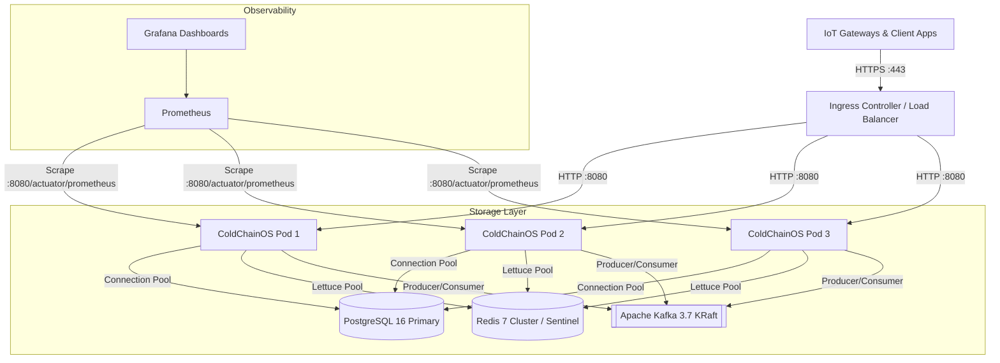

# ColdChainOS: Production Readiness & Operational Runbook

This document defines the production operational architecture, infrastructure configuration, disaster recovery procedures, regulatory compliance verification, and performance benchmarks for **ColdChainOS**.

---

## 1. Production Architecture Topology



---

## 2. Infrastructure Sizing & Resource Allocation

| Component | Minimum Nodes | CPU Request / Limit | Memory Request / Limit | Persistent Storage | Tuning Parameters |
| :--- | :--- | :--- | :--- | :--- | :--- |
| **ColdChainOS Application** | 3 (Horizontal Pod Autoscaling 3–10) | 1000m / 2000m | 1536Mi / 2048Mi | Stateless | `-XX:+UseG1GC -XX:MaxRAMPercentage=75.0` |
| **PostgreSQL 16** | 1 Primary + 1 Synchronous Replica | 2 vCPU / 4 vCPU | 4Gi / 8Gi | 250Gi NVMe SSD (IOPS 3000+) | `shared_buffers=2GB`, `max_connections=200`, `work_mem=16MB` |
| **Redis 7** | 3-node Sentinel / Cluster | 1 vCPU / 2 vCPU | 2Gi / 4Gi | 50Gi SSD (AOF enabled) | `maxmemory-policy volatile-lru` |
| **Apache Kafka 3.7** | 3 Brokers (KRaft Mode) | 2 vCPU / 4 vCPU | 4Gi / 8Gi | 500Gi NVMe SSD | `num.partitions=6`, `replication.factor=3`, `min.insync.replicas=2` |

---

## 3. Database Schema-per-Tenant Operations

### 3.1 Provisioning New Tenants
New tenants can be provisioned via the REST API or programmatic interface:
```bash
curl -X POST http://localhost:8080/api/v1/tenants/provision \
  -H "Authorization: Bearer <ADMIN_JWT_TOKEN>" \
  -H "Content-Type: application/json" \
  -d '{"tenantId": "pharma_corp", "companyName": "PharmaCorp Logistics"}'
```
*Creates dedicated schema `"tenant_pharma_corp"` and automatically executes Flyway forward migrations (`V1` through `V8`).*

### 3.2 Automated Database Backups
```bash
# Schema-isolated tenant export (Point-In-Time Recovery)
pg_dump -h postgres-primary -U coldchain_admin -d coldchainos_db \
  --schema="tenant_pharma_corp" -Fc -f "/backups/tenant_pharma_corp_$(date +%Y%m%d_%H%M%S).dump"

# Full cluster backup
pg_dumpall -h postgres-primary -U coldchain_admin -f "/backups/full_cluster_$(date +%Y%m%d).sql"
```

---

## 4. FDA 21 CFR Part 11 Audit Verification Runbook

Under regulatory inspection (FDA / EMA / WHO), compliance auditors may request proof that audit trails have remained unaltered.

### Executing Cryptographic Integrity Verification:
```bash
curl -X POST "http://localhost:8080/api/v1/benchmarks/audit-ledger?tenantId=pharma_corp&blocks=0" \
  -H "Authorization: Bearer <AUDIT_ADMIN_TOKEN>"
```

Expected JSON Response:
```json
{
  "benchmarkName": "21 CFR Part 11 Cryptographic Audit Verification",
  "totalOperations": 15420,
  "durationMillis": 145,
  "throughputOpsPerSec": 106344.83,
  "successfulOperations": 15420,
  "failedOperations": 0,
  "notes": "Appended 0 blocks; Traversed & verified 15420 SHA-256 blocks in 145 ms (Valid=true)"
}
```
*If a database administrator or malicious actor modified even a single byte in historical records, `Valid` will return `false` along with the exact corrupted `sequence_number`.*

---

## 5. Live Performance Benchmarking REST API

ColdChainOS includes built-in operational benchmark endpoints in `src/main/java/com/coldchainos/benchmark/`:

### 5.1 Telemetry Ingestion Throughput Benchmark
Tests Kafka partition throughput and consumer processing under load:
```bash
curl -X POST "http://localhost:8080/api/v1/benchmarks/telemetry?tenantId=pharma_corp&packets=5000&concurrency=20"
```

### 5.2 Redis Distributed Rate Limiter Saturation Benchmark
Tests Redis Token Bucket throughput and confirms strict quota enforcement:
```bash
curl -X POST "http://localhost:8080/api/v1/benchmarks/rate-limiter?tenantId=pharma_corp&requests=2000&capacity=100&refillRate=50"
```

### 5.3 Full Benchmark Suite Run
Executes the comprehensive suite (Rate Limiting, Cryptographic Audit Verification, and Telemetry Streaming):
```bash
curl -X POST "http://localhost:8080/api/v1/benchmarks/full-suite?tenantId=pharma_corp"
```

---

## 6. Observability, Prometheus Metrics & Health Endpoints

| Endpoint | Purpose | Access Control |
| :--- | :--- | :--- |
| `GET /actuator/health` | Overall system health (DB, Redis, Kafka, Disk) | Public / Authorized |
| `GET /actuator/health/liveness` | Kubernetes liveness probe (Container liveness) | Public |
| `GET /actuator/health/readiness` | Kubernetes readiness probe (Traffic routing) | Public |
| `GET /actuator/prometheus` | Prometheus metrics scraping | Scraper / Internal VPC |
| `GET /actuator/metrics` | Detailed JVM and application metrics | Admin |

### Key Prometheus Alerting Rules
- **Kafka Consumer Lag Alert**: Alert if `kafka_consumergroup_lag{topic="coldchain.telemetry.raw"}` exceeds `5000` for > 2 minutes.
- **Circuit Breaker Open Alert**: Alert if `resilience4j_circuitbreaker_state{state="open"}` equals `1` for > 30 seconds.
- **Temperature Excursion Spikes**: Alert if rate of `coldchain_excursions_detected_total` exceeds `10/min`.
- **Hikari Connection Exhaustion**: Alert if `hikaricp_connections_pending` > `5` for > 15 seconds.

---

## 7. Incident Response & Troubleshooting Playbook

### Scenario A: Poison Pill IoT Packets Blocking Kafka Partitions
1. Check `coldchain.telemetry.dlq` topic using Kafka CLI:
   ```bash
   kafka-console-consumer.sh --bootstrap-server kafka:9092 --topic coldchain.telemetry.dlq --from-beginning
   ```
2. Verify headers: `X-Exception-Message` and `X-Exception-Stacktrace` will state the root cause (e.g., malformed JSON payload or out-of-range sensor temperature).
3. The main consumer pipeline on `coldchain.telemetry.raw` automatically continues unimpeded.

### Scenario B: Circuit Breaker Trips on External Compliance Clearinghouse
1. The Circuit Breaker automatically shifts to `OPEN` status, gracefully failing over to offline pending verification without crashing user requests.
2. Monitor Resilience4j metrics in Prometheus: `resilience4j_circuitbreaker_calls_seconds_count`.
3. Once the remote clearinghouse recovers, the circuit breaker automatically transitions to `HALF_OPEN` to probe availability, then restores to `CLOSED`.
